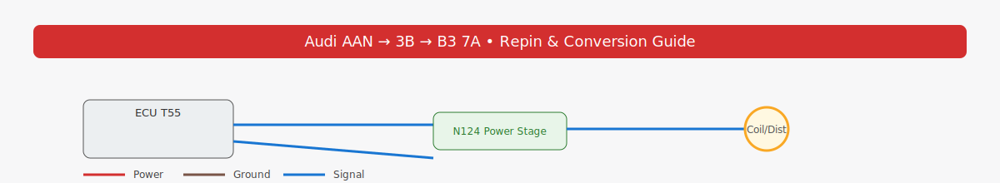

<!-- docs/index.md -->
<link rel="stylesheet" href="./assets/style.css">
<link rel="icon" href="./assets/audi-wiring-banner.svg">

  
  <h1>Audi AAN → 3B → B3 7A Repin & Conversion Guide</h1>
  
Rev 2 • October 31, 2025 • MIT License

## 📥 Downloads

  <a class="btn" href="../aan-3b-b3-repin-guide/spec/AAN_to_3B_B3_7A_Repin_Guide.pdf">⬇ Download PDF Guide</a>
  <a class="btn secondary" href="../aan-3b-b3-repin-guide/spec/AAN_to_3B_B3_7A_full.xlsx">⬇ Download Spreadsheet</a>

---

## 🧭 Overview
This documentation covers the full wiring adaptation of a **1992 AAN** engine harness to a **3B Motronic 2.3.1 ECU**, for use in a **B3 7A** chassis.

**Included:**
- Step-by-step ECU repinning
- Connector views (T6/T8 series)
- Diagnostics (2×2 port + MIL)
- Power/ground/fuse distribution
- Sources and verification checklist

---

## 📚 Reference Docs
- [SOURCES.md](./SOURCES.md)
- [Verification Checklist](./verification-checklist.md)
- [CHANGELOG.md](./CHANGELOG.md)
- [CONTRIBUTING.md](./CONTRIBUTING.md)

> Compiled and illustrated by Andrew Schlueter.  
> License: MIT • Revision 2 (2025-10-31)
